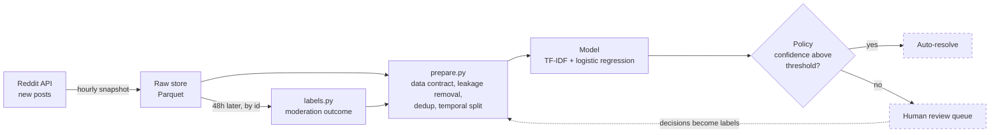

# Community Triage

**A content-triage system for online communities: it resolves the posts it is sure
about, and sends everything else to a human.**

Built on Reddit data, with the focus on what surrounds the model: a decision policy
with a precision guarantee, a data pipeline that only uses what exists at the moment
of decision, and real moderation outcomes as ground truth.

> **Status: active development.** The evaluation harness, decision layer and data
> pipeline are complete; moderation labels are being collected hourly; serving is
> next. See the [roadmap](#roadmap).

## At a glance

- **22.5% of the queue auto-resolved at 99.2% precision** on the two-community
  baseline, with every other post escalated to a human
  ([the metric](#the-metric))
- **+11 points over a hand-written regex**, and two very different models tie
  exactly — evidence the ceiling was the data, not the algorithm
  ([evidence](#what-the-evidence-says))
- **99% classification precision becomes ~54% precision on real flags** when the
  event being flagged occurs 1% of the time; a live probe then measured a ~1.3%
  moderator-removal rate ([base rates](#classification-precision-is-not-flag-precision))
- **~8,000 posts from 8 communities** collected under a submission-time data
  contract, with **439 label-leaking references** stripped
  ([data pipeline](#data-pipeline))
- **12 → 102 words per post** on average, by sampling what a moderation queue actually
  sees instead of all-time top posts
- **106 KB model, under 1 ms per decision, no GPU**; **78 tests**; every number in
  this README is generated by code, not typed

## How it fits together



Solid boxes are built and tested. Dashed boxes are the serving and review-queue
milestones on the roadmap.

## Roadmap

| Phase | Status | What it delivers |
|---|---|---|
| **0. Foundation** | ✅ Done | Reproducible evaluation harness; baselines; fixes to the original coursework (a test-set leak in cross-validation, a crashing notebook cell, a model comparison that cited the wrong model's score) |
| **1. Decision layer** | ✅ Done | Coverage at a fixed precision floor as the core metric; the base-rate analysis of flag precision |
| **2. Data pipeline** | ✅ Done | Resumable, rate-limited collector across 8 communities; submission-time data contract; leakage removal, deduplication, temporal split, with every removal reported |
| **3. Moderation labels** | 🔄 In progress | Hourly snapshots plus a 48-hour re-check by id to capture real moderator removals. Decision point at two weeks: is the removal rate high enough to train on? |
| **4. Re-evaluation** | ⬜ Next | Re-measure coverage on the 8-community, submission-time dataset; add a human baseline, to learn whether the measured ceiling is broken |
| **5. Serving** | ⬜ Planned | FastAPI `/classify` returning label, confidence, contributing words and model version; thresholds in config, not code; Docker |
| **6. Feedback loop** | ⬜ Planned | Review queue where a human's decision becomes a training label, and true flag precision is measured rather than assumed |
| **7. Operations** | ⬜ Planned | Drift monitoring, shadow deployment before promotion, an evaluation gate in CI, per-decision version logging |
| **Stretch** | ⬜ Planned | Transformer and LLM comparison on accuracy, latency and cost per million posts, where the 106 KB model is the bar to beat |

---

## The problem

Community moderators hand-review every post. Most of those calls are obvious, and
obvious calls are exactly what a cheap model should absorb. The hard part is not
classifying a post — it is knowing which posts you are allowed to be confident about,
so the system interrupts a human only when it is genuinely useful.

Reddit communities are the test bed. The same machinery applies to any short-text
routing problem — support-ticket triage, product categorisation, search-query intent —
where inputs are short, volume is high, and a wrong answer costs more in one direction
than the other.

## The metric

Accuracy alone does not describe a triage system. The number this project optimises is
**coverage at a fixed precision floor**: how much of the queue can be resolved
automatically while staying at or above a precision committed to in advance?


*Two-community baseline (r/harrypotter and r/marvel, 2,000 posts):*

| Precision floor | Threshold | Coverage (auto-resolved) | Achieved precision |
|---|---|---|---|
| 99% | 0.77 | **22.5%** ± 5.0% | 99.2% |
| 97% | 0.68 | 40.9% ± 1.6% | 97.3% |
| 95% | 0.65 | 48.5% ± 1.5% | 95.4% |

Coverage is averaged over five independent fold assignments and reported with its
spread. The 99% row is deliberately noisy (range 16.9%–29.3%): at that floor only a
few hundred posts clear the bar, so the estimate is genuinely unstable. Reporting the
single best split as "31.9%" would have been a nicer number and a worse measurement.

## Results

Model rows are averaged over 5-fold cross-validation repeated 5 times. The two
baselines involve no fitting, so they are scored on the full corpus.

| Approach | Accuracy |
|---|---|
| Majority class | 0.500 |
| Hand-written keyword regex | 0.712 |
| **TF-IDF + logistic regression** | **0.822** ± 0.015 |
| Multinomial Naive Bayes | 0.822 ± 0.015 |


## What the evidence says

**The model is worth 11 points over a regex.** A five-line pattern matching franchise
names reaches 0.712. That is the bar an ML pipeline has to clear to justify existing,
and it is the bar most write-ups never state.

**Two very different classifiers tie exactly.** Logistic regression and multinomial
Naive Bayes both land at 0.822. When models with different assumptions converge, the
limit is the information in the input, not the capacity of the learner.

**More data of the same kind will not help.** Accuracy flattens by ~1,200 training
documents.


**The ceiling was the input.** In the original corpus, 97.7% of posts have an empty
body. **63.7% contain no franchise-identifying word at all**, and many are unlabelable
by a human too:

> *"Very considerate of him."* · *"This one never gets old."* · *"Got my cast painted!"*

Removing every explicit franchise name costs only 6 points (0.822 → 0.760), so the
model is reading community writing style, not just proper nouns. The fix turned out
to be in how posts were sampled — see [the data pipeline](#data-pipeline).

### Classification precision is not flag precision

If this drives an off-topic detector, a flag fires when the model confidently disagrees
with the community a post was submitted to. Genuinely off-topic posts are rare, so most
disagreements are the model being wrong:


At a 1% base rate, 99% classification precision yields roughly **54% flag precision**.
A live probe later measured moderator removals at about 1.3% of new posts, so this is
the regime a real deployment operates in. Any deployment claim has to be made on the
flagging task, measured directly — not inherited from the classifier.

**Running it is free.** 106 KB on disk, ~0.1 ms p50 latency, over 100,000 docs/sec on a
laptop CPU, well under one CPU-hour per million documents. Any LLM alternative has to
justify itself against that.

## Data pipeline

**What gets collected is what a moderation queue actually sees:** newly submitted
posts, recorded with a timestamp of when they were observed. The original corpus
sampled all-time top posts, which are overwhelmingly images with one-line captions,
and that sampling choice created most of the ceiling measured above:

| Sample | Posts with body text |
|---|---|
| All-time top (original corpus) | ~2% |
| New posts, r/harrypotter | 98% |
| New posts, r/StarWars | 79% |
| New posts, r/marvel | 49% |

**A data contract limits features to what exists at submission time**, because that
is when the triage decision is made: title, body, flair, link domain, NSFW and
spoiler flags. Score, comment count and upvote ratio are measured later, and comments
have not been written yet, so none of them can become features. Training on comments
would inflate offline scores with information the deployed system never has.

Collection stays raw; every cleaning decision happens in `src/prepare.py`, and every
removal is counted in a report. It guards against three ways a dataset misleads:

- **Label leakage.** Posts carry a community's fingerprints — "crossposting from
  r/marvel", "this sub". Those are stripped so the model learns content rather than
  signatures. Franchise words themselves are kept: *Marvel* is content, *r/marvel*
  is the label.
- **Contradictory duplicates.** A post crossposted to two communities carries two
  labels. Every copy is removed — keeping one would pick a winner at random.
- **Temporal leakage.** The test set is the most recent 20% of each community, so the
  model is always evaluated on posts written after everything it trained on.

One-word posts ("Neat") are dropped from **training only**. They stay in the test set
because production still receives them, and escalating them is the correct behaviour.

| Corpus | Posts in → out | Leakage stripped | Cross-post conflicts | Mean words / post |
|---|---|---|---|---|
| Original (2 communities, top posts) | 2,000 → 1,819 | 18 | 11 | 12 |
| New collection (8 communities, new posts) | 7,984 → 7,903 | 439 | 28 | 102 |

### Moderation labels

Reddit hides removed posts from its listings, so a removal can only be observed by
recording a post while it is live and looking it up again by id later. An hourly job
snapshots new posts; 48 hours on, each is re-checked and labelled *kept*, *removed by
moderation*, or *deleted by author*. Deletion is the author's choice, not a moderation
decision, and never counts as a removal.

Only posts first seen under two hours old enter the removal rate: a post first seen at
five days old has already survived five days of moderation. A two-hour probe of 75
young posts found 1 moderator removal (~1.3%). At that rate, eight communities yield a
handful of removals a day, which is why phase 3 has an explicit decision point rather
than an open-ended collection.

## Tech stack

**Built:** Python · pandas · scikit-learn · PRAW (Reddit API) · Parquet / PyArrow ·
pytest · matplotlib · launchd scheduling

**Planned:** FastAPI · Docker · GitHub Actions (CI evaluation gate) · MLflow

## Repository

```
src/
  data.py       corpus loading, franchise-token utilities
  model.py      the pipeline, and the regex baseline it must beat
  policy.py     the decision layer: thresholds, coverage/precision, base-rate maths
  collect.py    resumable, rate-limited, multi-community collection
  prepare.py    leakage removal, deduplication, temporal split, data contract
  labels.py     delayed moderation labels: re-check posts 48h later by id
  evaluate.py   produces every number in this README
scripts/
  collect.py         CLI for collection
  prepare.py         CLI for preparation
  label.py           CLI for labelling; --stats for the current removal rate
  hourly.sh          one scheduled cycle: snapshot, then label what is due
  schedule.sh        install / status / uninstall the hourly job (macOS launchd)
  probe_removals.py  the feasibility probe that motivated the labelling design
  make_figures.py
tests/          78 tests: collector resume and data-loss regressions, leakage
                stripping, split integrity, label outcomes, policy maths, and an
                end-to-end collect -> prepare run
Code/           original exploratory notebooks, corrected
Data/           the original 2,000-post corpus; newly collected data is
                gitignored and regenerated by the scripts
reports/
  metrics.json  generated; the source for every figure quoted above
  figures/
```

## Reproduce

```bash
pip install -r requirements.txt
python -m src.evaluate        # writes reports/metrics.json
python scripts/make_figures.py
pytest                        # 78 tests
```

To collect fresh data, copy `.env.example` to `.env` and add Reddit API credentials:

```bash
python scripts/collect.py     # newest ~1,000 posts per community; safe to re-run
python scripts/prepare.py     # writes train/test Parquet + report.json
python scripts/label.py       # moderation outcomes for posts older than 48h
```

Collection is checkpointed: interrupt it and re-run freely, and completed posts are
skipped without spending a request.

## Limitations

- **Headline results are on two communities.** Marvel vs Harry Potter is far more
  separable than a real moderation queue; re-evaluating on the 8-community dataset is
  the next phase.
- **The community label is a proxy.** Community of origin is not the same as topic,
  and it is free rather than annotated. The moderation labels in phase 3 are the move
  toward real ground truth.
- **No human baseline yet.** Without knowing what a person scores on these posts,
  "82%" has no ceiling to be measured against.
- **Removals are only partly observable.** Posts filtered by AutoModerator never
  appear publicly, so the labels capture removals of posts that were visible — the
  harder calls a human moderator makes.
- **Collection runs on a laptop.** Hours the machine is asleep are hours of new posts
  first seen too late to count toward the removal rate.

## Data and credentials

Posts are collected through the public Reddit API (PRAW) in read-only mode.
Credentials are read from environment variables; see `.env.example`. The dataset holds
public post content and metadata, and no private user information.

---

*Started as a General Assembly capstone (2023), then rebuilt as a triage system. The
original coursework deck is kept at `reports/2023-ga-presentation.pdf` and predates
this framing.*
