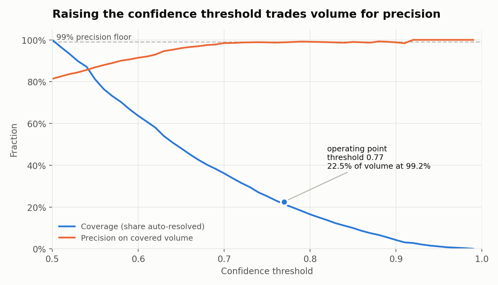
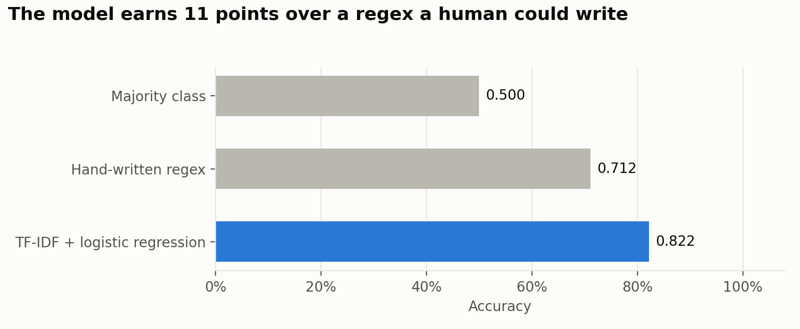
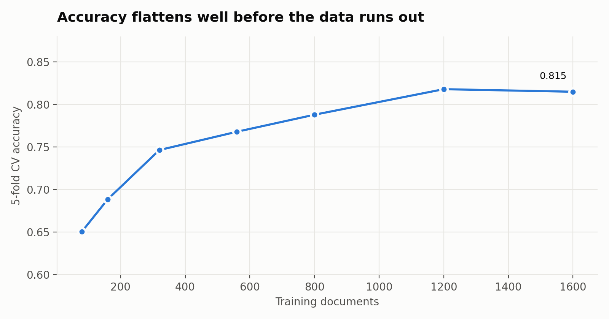
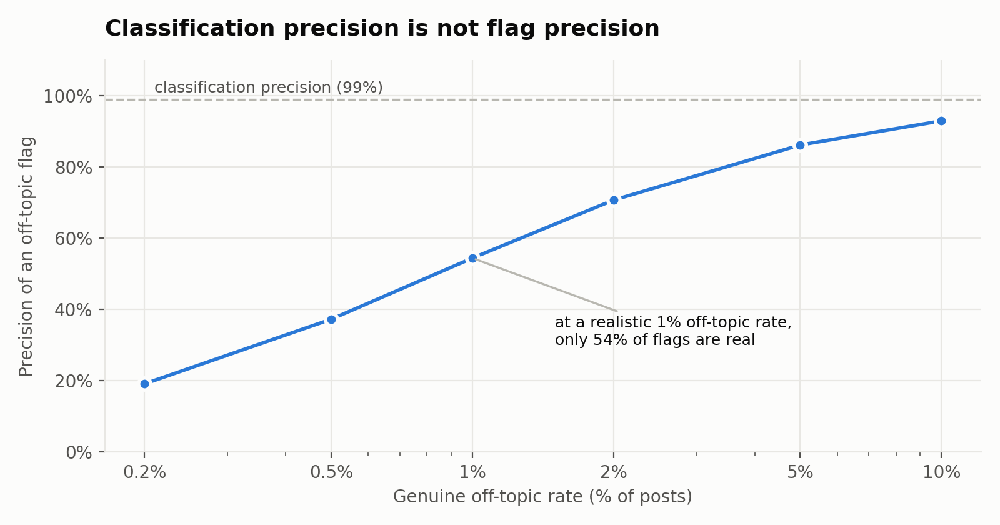

# Community Triage

**A short-text classifier that knows when to keep quiet.**

It resolves **22.5% of a review queue on its own at 99.2% precision** and escalates
everything else to a human. The model is **106 KB**, decides in **under a millisecond**, and needs
no GPU.

The interesting part of this project is not the accuracy. It is the decision layer
built on top of it, and the evidence for where the ceiling actually is.

---

## The problem

Community moderators hand-review every post. Most of those calls are obvious, and
obvious calls are exactly what a cheap model should absorb. The hard part is not
classifying a post — it is knowing which posts you are allowed to be confident about,
so the system interrupts a human only when it is genuinely useful.

This repository uses two Reddit communities (r/harrypotter and r/marvel) as a
stand-in: 2,000 posts, evenly split, classified by community of origin. The same
machinery applies to any short-text routing problem — support-ticket triage, product
categorisation, search-query intent — where inputs are a handful of words, volume is
high, and a wrong answer costs more in one direction than the other.

## The metric

Accuracy alone does not describe a triage system. The number this project optimises is
**coverage at a fixed precision floor**: how much of the queue can be resolved
automatically while staying at or above a precision we commit to in advance?



| Precision floor | Threshold | Coverage (auto-resolved) | Achieved precision |
|---|---|---|---|
| 99% | 0.77 | **22.5%** ± 5.0% | 99.2% |
| 97% | 0.68 | 40.9% ± 1.6% | 97.3% |
| 95% | 0.65 | 48.5% ± 1.5% | 95.4% |

Coverage is averaged over five independent fold assignments and reported with its
spread. The 99% row is deliberately noisy (range 16.9%–29.3%): at that floor only a
few hundred posts clear the bar, so the estimate is genuinely unstable. Reporting the
single best split as "31.9%" would have been a nicer number and a worse measurement.

## Results

Model rows are averaged over 5-fold cross-validation repeated 5 times. The two
baselines involve no fitting, so they are scored on the full corpus.

| Approach | Accuracy |
|---|---|
| Majority class | 0.500 |
| Hand-written keyword regex | 0.712 |
| **TF-IDF + logistic regression** | **0.822** ± 0.015 |
| Multinomial Naive Bayes | 0.822 ± 0.015 |



## What the evidence actually says

**The model is worth 11 points over a regex.** A five-line pattern matching franchise
names reaches 0.712. That is the bar an ML pipeline has to clear to justify existing,
and it is the bar most write-ups never state.

**Two very different classifiers tie exactly.** Logistic regression and multinomial
Naive Bayes both land at 0.822. When models with different assumptions converge, the
limit is the information in the input, not the capacity of the learner.

**More data of the same kind will not help.** Accuracy flattens by ~1,200 training
documents.



**The ceiling is the input.** 97.7% of posts have an empty body, leaving a median of
**7 words** per example. **63.7% contain no franchise-identifying word at all.** Many
are unlabelable by a human too:

> *"Very considerate of him."* · *"This one never gets old."* · *"Got my cast painted!"*

Removing every explicit franchise name costs only 6 points (0.822 → 0.760), so the
model is reading community writing style, not just proper nouns.

**Classification precision is not flag precision.** If this drives an off-topic
detector, a flag fires when the model confidently disagrees with the community a post
was submitted to. Genuinely off-topic posts are rare, so most disagreements are the
model being wrong:



At a realistic 1% off-topic rate, 99% classification precision yields roughly **54%
flag precision**. Any deployment claim has to be made on the flagging task, measured
directly — not inherited from the classifier.

**Running it is free.** 106 KB on disk, ~0.1 ms p50 latency, over 100,000 docs/sec on a
laptop CPU, well under one CPU-hour per million documents. Any LLM alternative has to justify
itself against that.

## Data pipeline

**What gets collected is what a moderation queue actually sees:** newly submitted
posts, recorded with a timestamp of when they were observed. The original corpus
sampled all-time top posts, which are overwhelmingly images with one-line captions,
and that sampling choice created most of the "information ceiling" measured above:

| Sample | Posts with body text |
|---|---|
| All-time top (original corpus) | ~2% |
| New posts, r/harrypotter | 98% |
| New posts, r/StarWars | 79% |
| New posts, r/marvel | 49% |

**A data contract limits features to what exists at submission time**, because that
is when the triage decision is made: title, body, flair, link domain, NSFW and
spoiler flags. Score, comment count and upvote ratio are measured later, and comments
have not been written yet, so none of them can become features. Training on comments
would inflate offline scores with information the deployed system never has.

Collection stays raw; every cleaning decision happens in `src/prepare.py`, and every
removal is counted in a report. It guards against three ways a dataset misleads:

- **Label leakage.** Posts carry a community's fingerprints — "crossposting from
  r/marvel", "this sub" — and comments (analysis mode only) add AutoModerator and
  moderator stickies. Those are stripped so the model learns content rather than
  signatures. Franchise words themselves are kept: *Marvel* is content, *r/marvel*
  is the label.
- **Contradictory duplicates.** A post crossposted to two communities carries two
  labels. Every copy is removed — keeping one would pick a winner at random.
- **Temporal leakage.** The test set is the most recent 20% of each community, so the
  model is always evaluated on posts written after everything it trained on.

One-word posts ("Neat") are dropped from **training only**. They stay in the test set
because production still receives them, and escalating them is the correct behaviour.

Run on the original 2,000 title-only posts, preparation found **11 posts crossposted
to both communities with contradictory labels**, **39 near-duplicate repeats**, and
**18 leakage strings in the titles alone** — all of which were in the original
training data.

## Repository

```
src/
  data.py       corpus loading, franchise-token utilities
  model.py      the pipeline, and the regex baseline it must beat
  policy.py     the decision layer: thresholds, coverage/precision, base-rate maths
  collect.py    resumable, rate-limited, multi-community collection
  prepare.py    leakage removal, deduplication, temporal split, data contract
  labels.py     delayed moderation labels: re-check posts 48h later by id
  evaluate.py   produces every number in this README
scripts/
  collect.py       CLI for collection
  prepare.py       CLI for preparation
  label.py         CLI for labelling; --stats for the current removal rate
  hourly.sh        one scheduled cycle: snapshot, then label what is due
  schedule.sh      install / status / uninstall the hourly job (macOS launchd)
  probe_removals.py  the feasibility probe that motivated the labelling design
  make_figures.py
tests/            78 tests: collector resume, leakage stripping, split integrity,
                  policy maths, and one collect -> prepare end-to-end run
Code/             exploratory notebooks (collection, EDA, modeling)
Data/             collected posts, 1,000 per community
reports/
  metrics.json    generated; the source for every figure quoted above
  figures/
```

## Reproduce

```bash
pip install -r requirements.txt
cp .env.example .env          # only needed to collect fresh data
python -m src.evaluate        # writes reports/metrics.json
python scripts/make_figures.py
pytest                        # 78 tests
```

To build a larger corpus — collect (interrupt and re-run freely; completed posts
are checkpointed and skipped), then prepare:

```bash
python scripts/collect.py      # newest ~1,000 posts per community; re-run daily
python scripts/prepare.py      # writes train/test Parquet + report.json
```

Every number in this README comes from `reports/metrics.json`. None are typed by hand.

## Roadmap

The classifier works. The system around it is the actual project.

- **Moderation labels (collecting).** Reddit hides removed posts from listings, so
  a removal can only be observed by recording a post while it is live and looking
  it up again by id later. An hourly job snapshots new posts; 48 hours on, each is
  re-checked and labelled *kept*, *removed by moderation*, or *deleted by author* —
  deletion is the author's choice, not a moderation decision, and is never counted
  as a removal. Only posts first seen under two hours old enter the removal rate:
  a post first seen at five days old has already survived five days of moderation.
  A two-hour probe of 75 young posts found 1 moderator removal (~1.3%), consistent
  with the ~1% base rate assumed in the flag-precision analysis above.
- **M1 — serving and policy.** A `/classify` endpoint returning label, confidence, the
  features that drove the call, and model version; thresholds in config, not code;
  tests and a container.
- **M2 — close the loop.** Scheduled collection and scoring, a review queue of
  confident disagreements, and a UI where a human's yes/no becomes training data. This
  is also what measures true flag precision rather than assuming it.
- **M3 — operate it.** Drift monitoring, shadow deployment before promotion, an
  evaluation gate in CI, and per-decision version logging.

Raising coverage is a **data** problem, not a modeling one — post bodies and comments,
and a wider set of confusable communities. Whether the 99% floor can reach 60% coverage
is an open question, not a promise.

## Limitations

- **The original corpus is title-only.** 97.7% of its bodies are empty, a product
  of sampling all-time top posts; the new-post collection fixes this.
- **Two classes, both easy.** Marvel vs Harry Potter is far more separable than the
  communities a real moderation queue spans.
- **The label is a proxy.** Community of origin is not the same as topic, and it is
  free rather than annotated — convenient, but not ground truth for off-topic-ness.
- **No human baseline yet.** Without knowing what a person scores on these titles,
  "82%" has no ceiling to be measured against.
- **The headline numbers still come from the October 2023 top-posts corpus.** They
  will be re-measured on the new-post collection once enough has accumulated.

## Data and credentials

Posts were collected through the public Reddit API (PRAW) in read-only mode. Credentials
are read from environment variables; see `.env.example`. The dataset holds public post
metadata and no private user information.

---

*Built on a General Assembly capstone. The original coursework deck is kept at
`reports/2023-ga-presentation.pdf` and predates this framing.*
