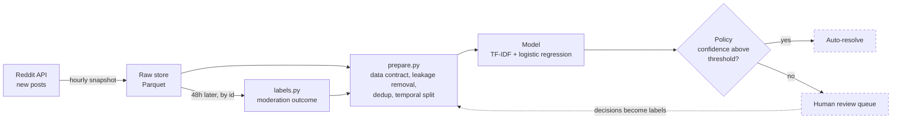

# ModSieve

A first-pass moderation tool for online communities. It handles the posts it's
confident about and sends the rest to a human moderator.

I built it on Reddit data. The model itself is simple (TF-IDF + logistic
regression); most of the work went into the parts around it: a decision rule
that holds a fixed precision, a data pipeline that only uses information
available when a post is submitted, and real moderator removals as labels.

> **Status:** in progress. The evaluation code, decision layer and data pipeline
> are done. Moderation labels are being collected hourly. Serving is next (see the
> [roadmap](#roadmap)).

## Summary

- On the two-community baseline, the model auto-resolves **22.5% of posts at 99.2%
  precision** and sends everything else to a human ([the metric](#the-metric)).
- It beats a hand-written regex by **11 points**. Logistic regression and Naive
  Bayes score exactly the same, which suggests the data is the limit, not the model
  ([details](#what-the-results-show)).
- I labelled 200 posts myself without seeing the answers and scored **0.802**. The
  model scored **0.820** on the same posts ([human baseline](#human-baseline)).
- 99% classification precision turns into only **~54% flag precision** when the
  thing being flagged happens 1% of the time. A live probe measured moderator
  removals at about 1.3% ([base rates](#classification-precision-vs-flag-precision)).
- Collected **~8,000 posts from 8 communities** and removed **439 references**
  that gave away the label ([data pipeline](#data-pipeline)).
- Average post length went from **12 to 102 words** by collecting new posts
  instead of all-time top posts.
- The model is **106 KB** and takes **under 1 ms** per post on a CPU. There are
  **81 tests**, and all numbers in this README come from `src/evaluate.py` or
  `scripts/human_baseline.py`.

## How it fits together



Solid boxes are built and tested. Dashed boxes are still on the roadmap.

## Roadmap

| Phase | Status | What it covers |
|---|---|---|
| 0. Foundation | Done | Reproducible evaluation, baselines, and fixes to the original coursework (a test-set leak in cross-validation, a notebook cell that crashed, and a comparison that quoted the wrong model's score) |
| 1. Decision layer | Done | Coverage at a fixed precision as the main metric; base-rate analysis of flag precision |
| 2. Data pipeline | Done | Resumable, rate-limited collector for 8 communities; submission-time data contract; leakage removal, deduplication and a temporal split, with every removal reported |
| 3. Moderation labels | In progress | Hourly snapshots, plus a re-check by id 48 hours later to catch moderator removals. After two weeks I'll decide whether the removal rate is high enough to train on |
| 4. Re-evaluation | Next | Re-measure coverage on the 8-community dataset and repeat the human baseline there |
| 5. Serving | Planned | FastAPI `/classify` endpoint returning label, confidence, top words and model version; thresholds in config; Docker |
| 6. Feedback loop | Planned | A review queue where moderator decisions become training labels, so flag precision can be measured directly |
| 7. Operations | Planned | Drift monitoring, shadow deployment, an evaluation check in CI, version logging per decision |
| Stretch | Planned | Compare against a transformer and an LLM on accuracy, latency and cost per million posts |

---

## The problem

Moderators review every post by hand, and most of those calls are easy. Easy calls
are what a cheap model should take off their plate. The tricky part is knowing which
posts the model can be trusted on, so a human only gets pulled in when it matters.

I used Reddit communities to test this, but the same setup works for other short-text
routing problems like support tickets, product categories or search intent: short
inputs, lots of volume, and mistakes that cost more in one direction than the other.

## The metric

Accuracy doesn't tell you much about a triage system. What I optimise instead is
**coverage at a fixed precision**: how much of the queue can be handled automatically
while precision stays at or above a level chosen up front.


*Two-community baseline (r/harrypotter and r/marvel, 2,000 posts):*

| Precision floor | Threshold | Coverage (auto-resolved) | Achieved precision |
|---|---|---|---|
| 99% | 0.77 | **22.5%** ± 5.0% | 99.2% |
| 97% | 0.68 | 40.9% ± 1.6% | 97.3% |
| 95% | 0.65 | 48.5% ± 1.5% | 95.4% |

Coverage is averaged over five different fold assignments. The 99% row varies a lot
(16.9% to 29.3%) because only a few hundred posts clear that threshold. The best
single split gave 31.9%, but I report the average since that's the more honest
estimate.

## Results

Model accuracy is averaged over 5-fold cross-validation repeated 5 times. The two
baselines don't learn anything, so they're scored on the full dataset.

| Approach | Accuracy |
|---|---|
| Majority class | 0.500 |
| Hand-written keyword regex | 0.712 |
| **TF-IDF + logistic regression** | **0.822** ± 0.015 |
| Multinomial Naive Bayes | 0.822 ± 0.015 |


## What the results show

A five-line regex that matches franchise names gets 0.712, so the model adds 11
points on top of that. I think this is the fair comparison for whether ML is worth
it here.

Logistic regression and Naive Bayes both land at 0.822. They make pretty different
assumptions, so getting the same score points to the input being the limit rather
than the model.

The learning curve flattens out around 1,200 training posts, so more of the same kind
of data probably won't help.


Looking at the data explains why. In the original dataset 97.7% of posts have no body
text, and 63.7% don't mention anything franchise-specific. A lot of them can't really
be labelled by a person either:

> *"Very considerate of him."* · *"This one never gets old."* · *"Got my cast painted!"*

Removing every franchise name only drops accuracy by 6 points (0.822 to 0.760), so the
model is also picking up on how each community writes. The real fix was changing how
posts get sampled, which is covered in the [data pipeline](#data-pipeline) section.

### Human baseline

I wanted to know whether 0.822 was a model problem or a data problem, so I labelled
a fixed sample of 200 posts myself (100 from each community). I only saw the post
text: no subreddit, score or author. I could also answer "unsure". The model is
scored on the same 200 posts using out-of-fold predictions, so it hadn't seen them
during training either.

| On the same 200 posts | Me | Model |
|---|---|---|
| Accuracy if forced to choose ("unsure" counts as a coin flip) | 0.802 [0.760, 0.845] | 0.820 [0.770, 0.875] |
| Accuracy on the posts I answered (72.5%), vs. the model skipping its least confident 27.5% | 0.917 | 0.903 |
| Posts that mention a franchise name (72) | 0.951 | 0.958 |
| Posts that don't (128) | 0.719 | 0.742 |

*Brackets are bootstrap 95% confidence intervals.*

The model and I are basically tied, so the ceiling seems to be the posts
themselves. A few other things stood out:

- On the 55 posts I marked unsure, the model still got 70.9% right. It's picking
  up on writing style that I couldn't see. Cohen's kappa between me and the model
  is 0.635, so we mostly agree but get different posts wrong.
- About 5 of my 12 wrong answers were just slips, e.g. I put "Into the
  Spider-Verse" under Harry Potter. I left them in because that's part of how
  people actually label, and it's the reason labelling teams use more than one
  annotator.
- I took a median of 2.8 seconds per post. That works out to about 790 hours of
  human time per million posts, compared with under one CPU-hour for the model.

This is only one annotator, and I'd already seen a lot of this data, so the human
numbers are probably on the high side. The script supports more annotators on the
same sample and reports agreement between them.

### Classification precision vs. flag precision

If the model is used to flag off-topic posts, a flag goes up whenever the model is
confident a post belongs to a different community than the one it was posted in.
Off-topic posts are rare, so most of those flags end up being model mistakes:


At a 1% base rate, 99% classification precision gives only about **54% flag
precision**. The live probe measured moderator removals at about 1.3% of new posts,
so a real deployment would sit right in this range. Any claim about flagging needs
to be measured on the flagging task itself.

Running the model costs almost nothing: 106 KB on disk, about 0.1 ms median latency,
and over 100,000 posts per second on a laptop CPU. An LLM would need to be a lot
more accurate to be worth the extra cost.

## Data pipeline

The new collection pulls newly submitted posts, which is what a moderation queue
actually sees, and records when each one was observed. The original dataset used
all-time top posts, which are mostly images with a one-line caption. That choice
caused most of the ceiling described above:

| Sample | Posts with body text |
|---|---|
| All-time top (original dataset) | ~2% |
| New posts, r/harrypotter | 98% |
| New posts, r/StarWars | 79% |
| New posts, r/marvel | 49% |

Features are limited to what exists when a post is submitted, since that's when the
triage decision happens: title, body, flair, link domain, and the NSFW and spoiler
flags. Score, comment count and upvote ratio only exist later, and there are no
comments yet, so none of those are used. Training on them would make offline
results look better than what the deployed model could do.

Raw data is stored as collected, and all the cleaning happens in `src/prepare.py`,
which reports how many posts each step removes. It handles three problems:

- **Label leakage.** Posts often mention their community ("crossposting from
  r/marvel", "this sub"). I strip those so the model learns from the content.
  Franchise names stay in, since *Marvel* is content but *r/marvel* is basically
  the label.
- **Conflicting duplicates.** A post crossposted to two communities has two
  different labels, so I drop every copy instead of picking one.
- **Temporal leakage.** The test set is the most recent 20% of each community, so
  the model is always tested on posts newer than anything it trained on.

One-word posts like "Neat" are removed from the training set only. They stay in the
test set because they'll show up in production too, and the right thing to do with
them is escalate.

| Dataset | Posts in → out | Leakage stripped | Crosspost conflicts | Mean words / post |
|---|---|---|---|---|
| Original (2 communities, top posts) | 2,000 → 1,819 | 18 | 11 | 12 |
| New collection (8 communities, new posts) | 7,984 → 7,903 | 439 | 28 | 102 |

### Moderation labels

Reddit hides removed posts from its listings, so the only way to see a removal is to
record the post while it's live and look it up again later by id. An hourly job
saves new posts, and 48 hours later each one is checked and marked as *kept*,
*removed by moderators* or *deleted by the author*. Author deletions don't count as
removals.

Only posts first seen when they were under two hours old count toward the removal
rate, because a post first seen at five days old has already made it through five
days of moderation. A quick probe of 75 young posts found 1 moderator removal
(~1.3%). At that rate eight communities only produce a handful of removals a day,
which is why phase 3 has a check-in point after two weeks.

## Tech stack

**Built:** Python, pandas, scikit-learn, PRAW (Reddit API), Parquet / PyArrow,
pytest, matplotlib, launchd for scheduling

**Planned:** FastAPI, Docker, GitHub Actions, MLflow

## Repository

```
src/
  data.py            loading the dataset, franchise-name helpers
  model.py           the model pipeline and the regex baseline
  policy.py          thresholds, coverage/precision, base-rate calculations
  collect.py         resumable, rate-limited collection across communities
  prepare.py         leakage removal, deduplication, temporal split
  labels.py          re-checks posts after 48h to get moderation outcomes
  evaluate.py        generates the numbers in this README
  human_baseline.py  sampling and scoring for the human baseline
scripts/
  collect.py         run collection
  prepare.py         run preparation
  label.py           run labelling; --stats shows the current removal rate
  hourly.sh          one scheduled run: collect, then label whatever is due
  schedule.sh        install / check / remove the hourly job (macOS launchd)
  probe_removals.py  the early probe used to check removals were observable
  human_baseline.py  label the sample by hand, then score it against the model
  make_figures.py
tests/               81 tests (collector resume, leakage stripping, split
                     integrity, label outcomes, policy maths, end-to-end run)
Code/                original exploratory notebooks, with fixes
Data/                the original 2,000-post dataset; newly collected data is
                     gitignored and can be regenerated with the scripts
reports/
  metrics.json       generated; source of the numbers above
  human_baseline/    the sample, my answers, and the scored results
  figures/
```

## Reproduce

```bash
pip install -r requirements.txt
python -m src.evaluate                   # writes reports/metrics.json
python scripts/make_figures.py
pytest                                   # 81 tests
python scripts/human_baseline.py score   # re-scores the saved human answers
```

To collect new data, copy `.env.example` to `.env` and add your Reddit API
credentials:

```bash
python scripts/collect.py     # newest ~1,000 posts per community; safe to re-run
python scripts/prepare.py     # writes train/test Parquet + report.json
python scripts/label.py       # moderation outcomes for posts older than 48h
```

Collection saves its progress, so you can stop and restart it and it won't
re-download posts it already has.

## Limitations

- **The main results are on two communities.** Marvel vs. Harry Potter is much
  easier to separate than a real moderation queue. Re-running on the 8-community
  dataset is the next phase.
- **Community is a stand-in label.** Which community a post came from isn't the
  same as its topic, it's just a free label. The moderation labels in phase 3 are
  meant to fix this.
- **The human baseline has one annotator**, and it's me, so I'd already seen the
  data. Someone new labelling the same sample would make it more reliable and give
  an agreement score.
- **Not every removal is visible.** Posts that AutoModerator filters never show up
  publicly, so the labels only include removals of posts that were visible for a
  while.
- **Collection runs on my laptop.** When it's asleep, new posts get seen too late
  to count toward the removal rate.

## Data and credentials

Posts are collected through the public Reddit API (PRAW) in read-only mode.
Credentials come from environment variables (see `.env.example`). The data only
includes public post content and metadata.

---

*This started as my General Assembly capstone in 2023, and I later rebuilt it as a
triage system. The original presentation is in `reports/2023-ga-presentation.pdf`
and is from before the rebuild.*
